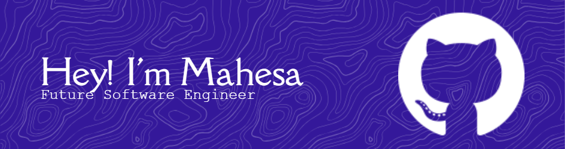

<!-- HEADER -->

  

<h2 align="center">
  <i>"Code, pixels, and a bit of storytelling:P"</i>
</h2>

  

<!-- SOCIAL LINKS -->

  
  
   
  <b>📫 Reach me:</b> <a href="mailto:mahesamp@gmail.com">mahesamp@gmail.com</a>

---

<!-- TECH STACK -->
## 🛠 Tech Stack

  
  
   
  
  

  
  
  
  
  
  
  

---

<!-- FEATURED PROJECT -->
### 🌌 Featured Project

#### 🎮 [Stairway to Aluna](https://github.com/Vuxyn/Stairway-to-Aluna)
> A Platformers pixel RPG about memory, love, and quiet tragedy.  
> *Inspired by Re:Zero and Sousou no Frieren.*  
> Built with ❤️ in Java, and lots of midnight coffee ☕.

---

  
  

---
<!-- FOOTER -->

  

